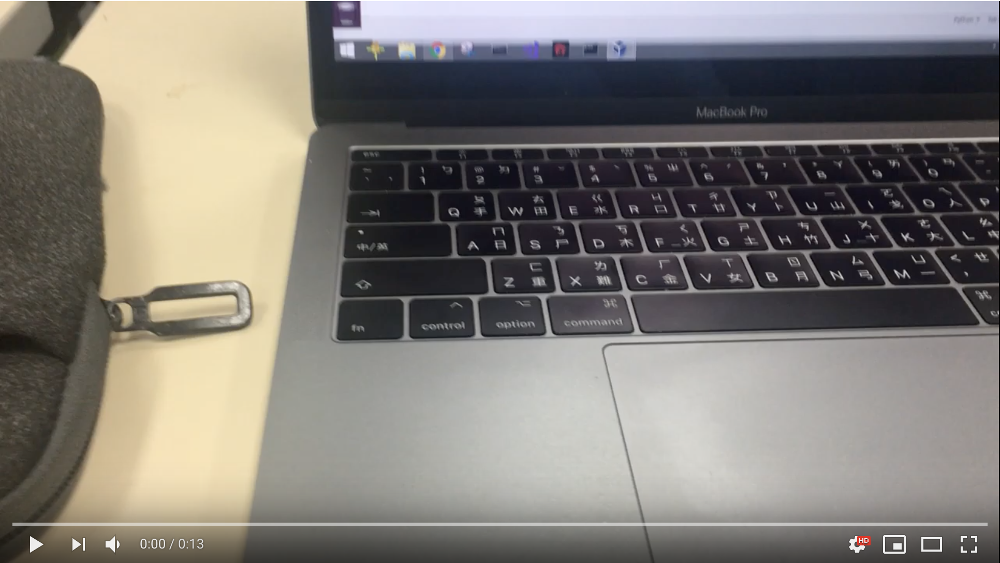
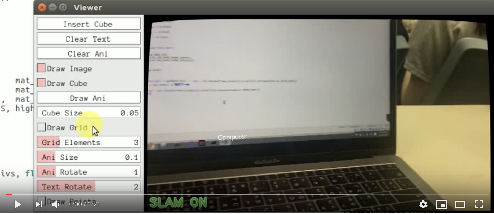
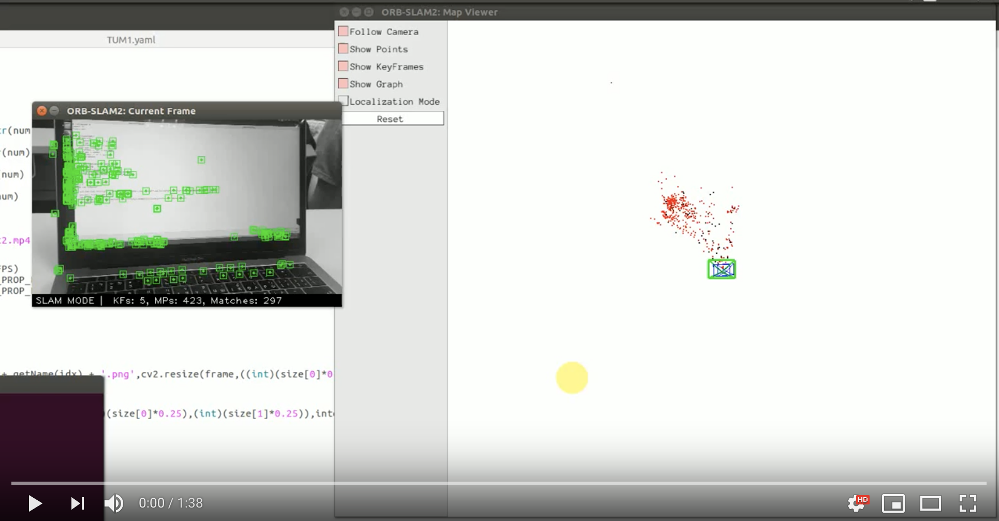
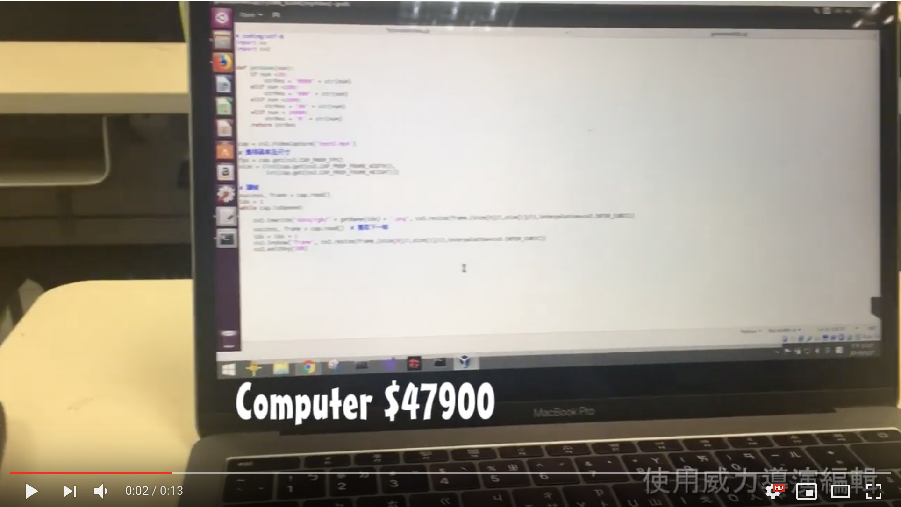
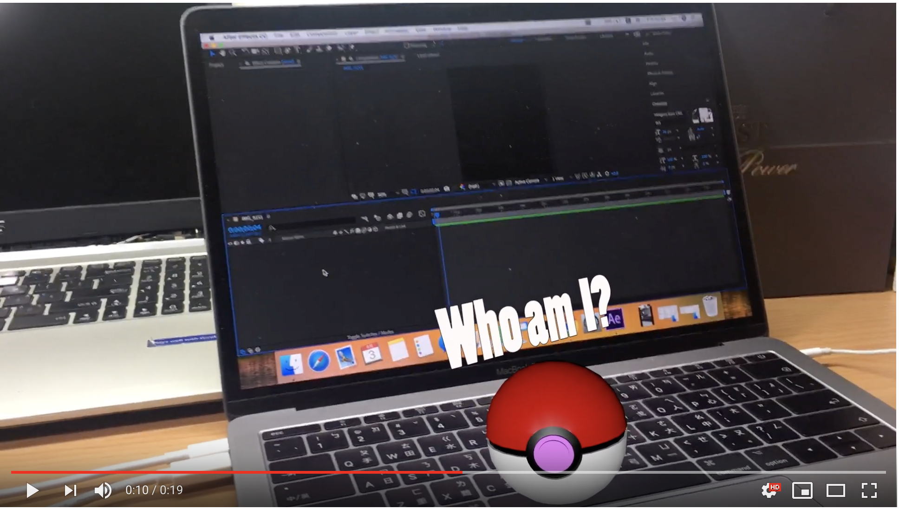
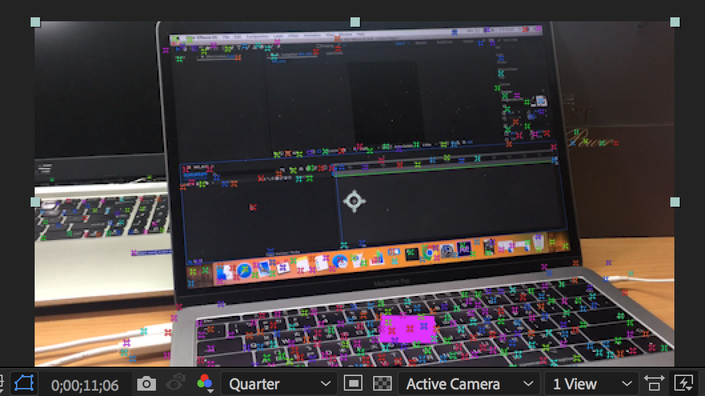
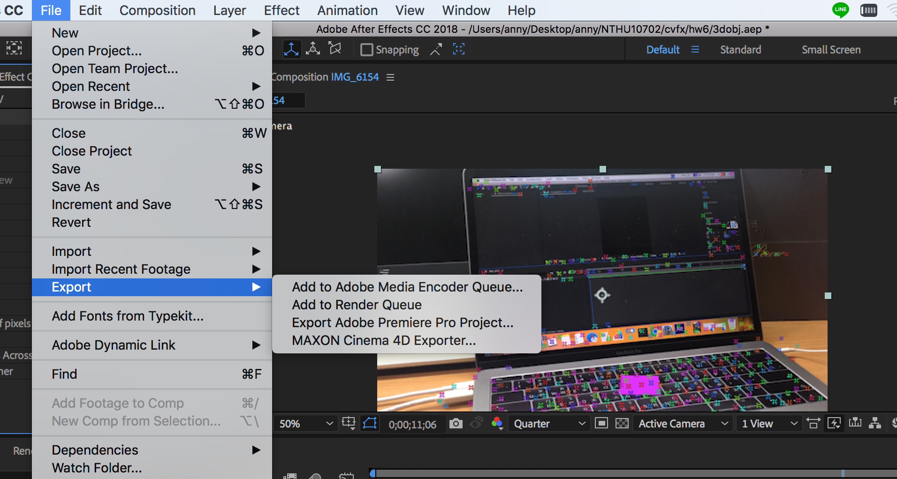
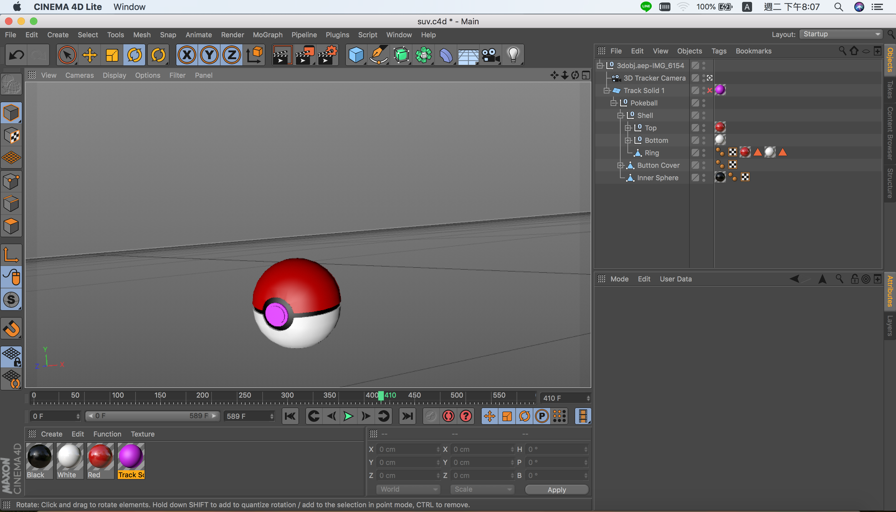
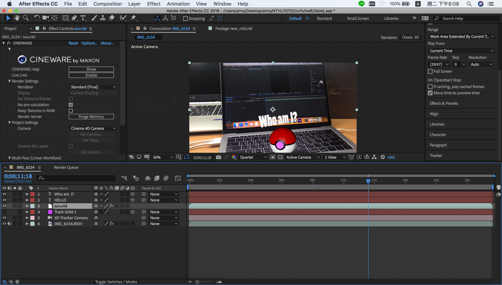

# 2019CVFX_Homework6_Team5

## Original Videos
#### Video 1

## ORB-SLAM2
### ORB-SLAM2

ORB-SLAM2            |  Map           
:-------------------------:|:-------------------------:
 | 

ORB-SLAM2 能夠提取圖片的特徵並做 pose estimation。我們對提供的 ros 範例中的monoAR 進行修改，讓他能夠放入我們想要的 model 以及文字。 

#### Insert 3D model
在 insert OBJ 的時候會依趙所計算出來的 map 去做 plane 的 detection，如果找得到的話則可以將 obj 插入 plane 的位置。
由於這份 code 所使用的 opengl 版本比較舊，並且插入方塊的部分並非 pipeline 的方式，所以我上網找了 GLM，利用他所提供的  glmDraw(GLMmodel* model, GLuint mode) 就可以順利的將 OBJ 檔 load 進去，缺點是無法貼上 texture。為了讓立體的效果可以看得出來，我們還加了 lightening 的效果，讓 obj 產生立體感。最後在播放的時候，plane 會根據每個 frame 的 pose 進行移動，而我們所加入的 obj 則會跟著 plane 進行移動，達到 match moving 的效果。

## 威力導演

 
利用威力導演中的 track motion 的功能，與 ORB-SLAM2 不同的是，他並非直接去算每個 frame，得到所有的 pose estimation 以及 local map，而是只對於某一部份的追蹤。所以我們只需要框出我們想要 track 的部分，接下來他就會對框選的部分進行 tracking。追蹤結束後他會算出選取地方移動的軌跡，此時我們就可以在上面加上想要插入的圖片、影片、文字以及特效。
 
雖然使用威力導演去做比用 ORB-SLAM2 來得容易許多，並且計算速度上也較快，但是結果上也較不準確。由影片中我們可以看出，插入的物件都會有一些浮動的感覺。並且當我們在追蹤的時候，如果追蹤的物體消失在畫面中，那追蹤的方框不會自動隱沒的影片外，而是會被畫面的邊邊推著走，導致軌跡錯誤。因此還需要人工去調整追蹤的位置。

## After Effects

### Insert 3D object by Cinema 4D Lite 

 
首先利用 camera tracker 得到追蹤點，然後選取我們想要加上東西的平面後創建一個 solid 作為等一下要放 3D 物件的標記。 
接下來將我們的檔案 export 成一個 C4d 檔，然後開啟一個新的 C4d 檔。我們將物件的 C4d 檔與原本的 tracking C4d 檔 merge 在一起，並把物件放到我們創建的 solid 的 hierachy 中，隱藏 solid 後存檔就可以了。最後只要將這個 C4d import 到我們的 ＡE 專案裝就大功告成了！

    
    
    
    

## Compare with Above Methods
總體來說，相對於威力導演，ORB-SLAM 以及 AE 都是對影片的整個 frame 去計算出所有的追蹤點，再進行物件的插入，所以以準確度上來說比較高，但相對來說計算上就會比較耗時。而 ORB-SLAM2 在安裝上我們遇到了很多的問題，需要安裝許多東西，而且有版本上的限制，所以光是安裝就花了不少的時間。而威力導演如上面所提到，雖然比較快，但他的結果也比較不準確，並且能插入的東西也不如 AE 來的有彈性。 以下是一個簡單的比較表格 

比較 | ORB-SLAM2 |威力導演           |  After Effect CC
:-------------------------:|:-------------------------:|:-------------------------:|:-------------------------:
安裝難易度  | 非常難 | 簡單（註冊後可得 30 天免費版本，學校有校園授權軟體） |  普通（試用版 7 天，永久的要錢）
操作難易度  | 非常難 | 簡單 |  簡單
追蹤準確度  | 高 | 低 |  高
速度  | 慢 | 快 |  慢
